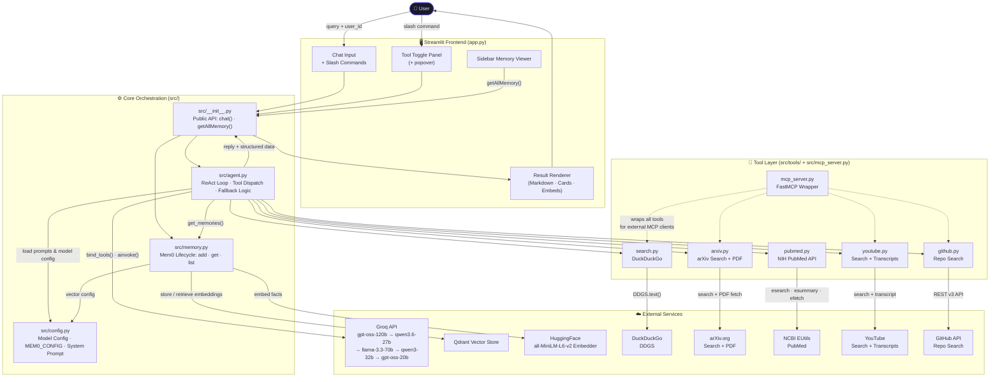
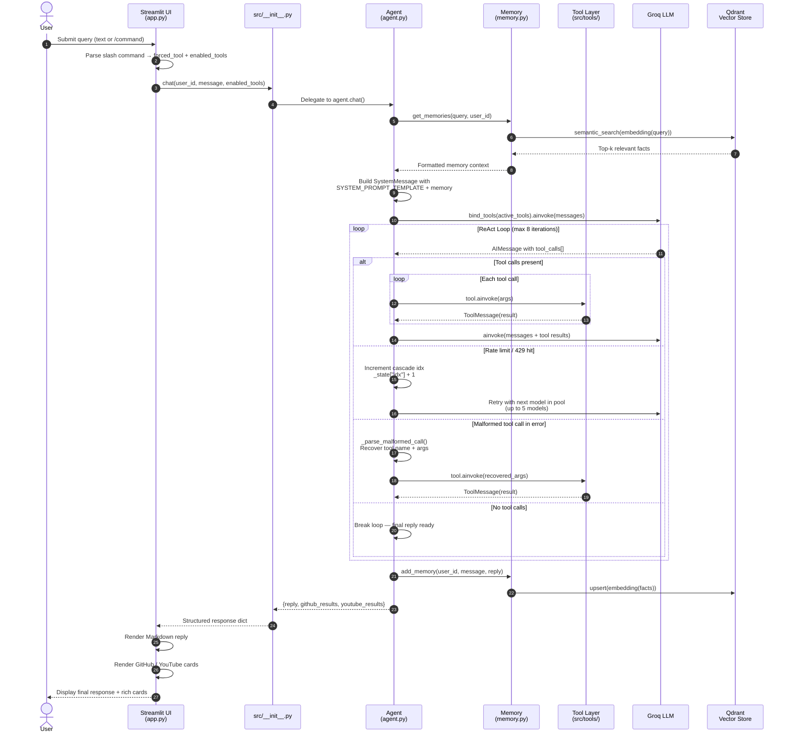
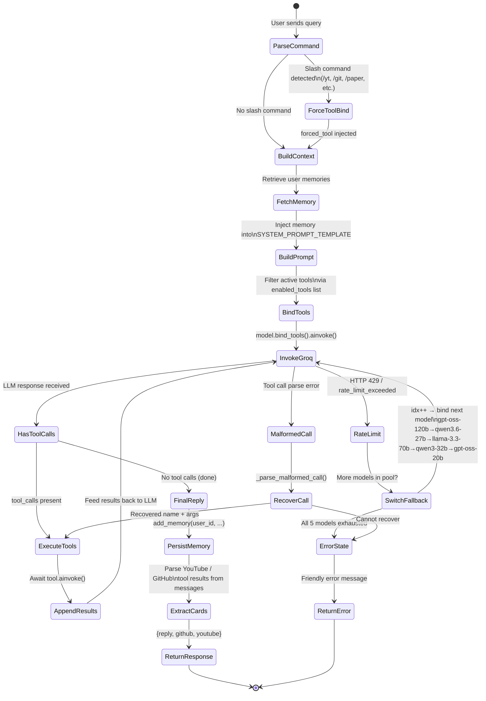
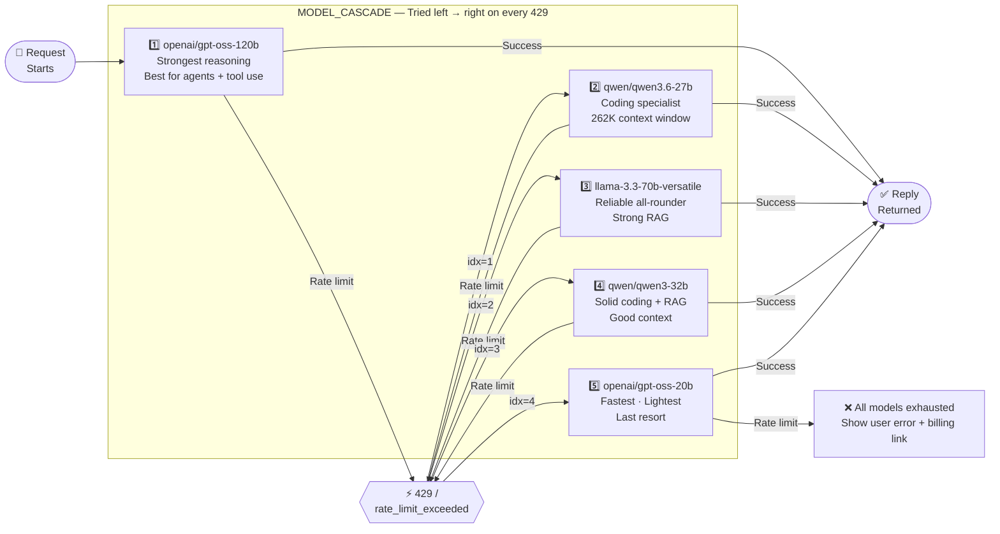
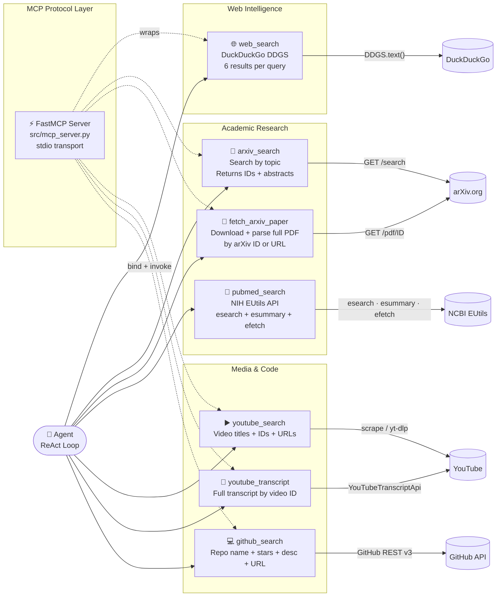
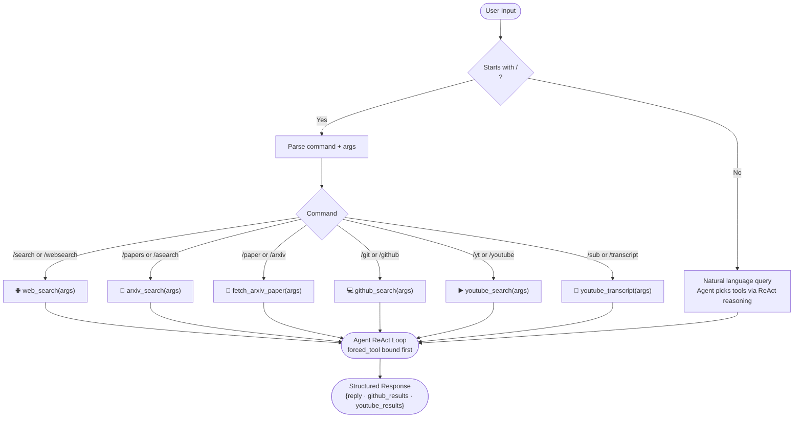

<div align="center">

# Personal Research Assistant

**An autonomous AI research agent with persistent semantic memory, multi-source tool orchestration, and a real-time Streamlit UI**

[](https://python.org)
[](https://console.groq.com)
[](https://langchain.com)
[](https://streamlit.io)
[](https://mem0.ai)
[](https://github.com/jlowin/fastmcp)
[](https://qdrant.tech)

*Ask questions, discover papers, search code, watch videos — all in one session, with memory that persists across conversations.*

</div>

---

## Overview

The Personal Research Assistant is a fully autonomous, agentic research system. It combines a multi-step reasoning loop with semantic long-term memory and a rich tool ecosystem spanning web search, arXiv, PubMed, YouTube, and GitHub. Each conversation is personalized to the user and builds on past research sessions, eliminating the need to repeat context.

**Core capabilities at a glance:**

| Capability | Description |
|---|---|
| Autonomous reasoning | LangChain ReAct loop decides which tools to call and in what order |
| Persistent memory | Mem0 stores and retrieves facts per user across sessions using vector search |
| Multi-source research | 8 tools: web, arXiv (search + PDF), PubMed, YouTube (search + transcript), GitHub |
| Slash command routing | `/papers`, `/git`, `/yt`, `/sub`, `/search`, `/paper` map directly to tools |
| 5-model cascade | Auto-advances through 5 Groq models on rate-limit — session never drops |
| MCP protocol support | All tools are also exposed as a FastMCP server for external integrations |

---

## System Architecture

### High-Level Architecture



---

### Request Lifecycle — Sequence Diagram



---

### Agent ReAct Execution Loop — State Machine



---

### Model Cascade — Automatic Rate-Limit Recovery



> All 5 models are initialized at startup into `_model_pool`. Switching happens **mid-loop** — the conversation, tool results, and message history are preserved across the switch.

---

### Memory System Architecture


---

### Tool Ecosystem Map



---

### Slash Command → Tool Routing



---

## Directory Structure

```
Personal research assistant/
│
├── app.py                          # Streamlit dashboard entry point
├── requirements.txt                # Project dependencies
├── .env                            # API keys (not committed)
├── .gitignore
├── README.md
│
├── public/
│   └── arct.png                    # Architecture diagram image
│
├── src/                            # Core application package
│   ├── __init__.py                 # Public API: chat(), getAllMemory()
│   ├── config.py                   # MEM0_CONFIG, model IDs, SYSTEM_PROMPT_TEMPLATE
│   ├── agent.py                    # ReAct loop, tool binding, fallback, slash routing
│   ├── memory.py                   # Mem0 wrapper: add_memory(), get_memories()
│   ├── mcp_server.py               # FastMCP server exposing all tools over stdio
│   │
│   └── tools/                      # Modular tool implementations
│       ├── __init__.py
│       ├── search.py               # DuckDuckGo web search (DDGS)
│       ├── arxiv.py                # arXiv keyword search + full PDF extraction
│       ├── pubmed.py               # PubMed search via NIH EUtils API
│       ├── youtube.py              # YouTube search + transcript fetching
│       └── github.py               # GitHub repository search
│
└── tests/                          # Test suite
    ├── __init__.py
    ├── test_agent.py               # End-to-end agent + tool-call test
    ├── test_imports.py             # Dependency import verification
    └── test_memory.py              # Mem0 initialization + embedding test
```

---

## Features

### Autonomous Multi-Step Research
The LangChain ReAct agent loop reasons over tool results iteratively. A single query like *"explain graph RAG"* triggers: `web_search` → `arxiv_search` → `fetch_arxiv_paper` (×2–3) → synthesized answer with full citations — with no manual intervention.

### Semantic Long-Term Memory
Mem0 extracts facts from each conversation turn and stores them as dense vectors in Qdrant. On the next session, the top-5 most relevant memories are retrieved and injected into the system prompt, giving the assistant context about past research without re-stating it.

### PubMed Integration
Peer-reviewed biomedical papers from NCBI PubMed are accessible via the three-stage EUtils pipeline: `esearch` (discover PMIDs) → `esummary` (metadata) → `efetch` (full abstracts). Ideal for clinical and life-science research queries.

### arXiv Full-Text Reading
Instead of relying on short descriptions, `fetch_arxiv_paper` downloads the actual PDF and extracts its text so the LLM reasons over full methodology sections, not just titles.

### YouTube Intelligence
Search for tutorial videos on any topic and extract full transcripts for summarization — useful for understanding talks, lectures, and demos without watching them.

### GitHub Code Discovery
Search repositories by topic, returning name, stars, description, and URL rendered as interactive cards in the UI.

### 5-Model Cascade — Zero-Drop Rate-Limit Recovery
All five Groq models are initialized at startup into a pool. When any model returns a `429 / rate_limit_exceeded`, the agent increments the cascade index and rebinds the next model **mid-loop** — preserving the full message history, tool results, and conversation state. The cascade order is:

| Priority | Model ID | Strength |
|---|---|---|
| 1 (Primary) | `openai/gpt-oss-120b` | Strongest reasoning, best tool use |
| 2 | `qwen/qwen3.6-27b` | Coding specialist, 262K context |
| 3 | `llama-3.3-70b-versatile` | Reliable all-rounder |
| 4 | `qwen/qwen3-32b` | Solid RAG + coding |
| 5 (Last resort) | `openai/gpt-oss-20b` | Fastest, lightest |

If all 5 are exhausted the user sees a single message listing exactly which models were tried.

### Malformed Tool Call Recovery
A regex-based parser recovers tool calls that arrive as raw text instead of structured JSON (a known behavior in some Groq model responses), preventing silent failures.

### FastMCP Protocol Layer
All tools are exposed as a FastMCP server (`src/mcp_server.py`) over stdio, making the tool ecosystem compatible with any MCP-capable client or orchestrator.

### Per-User Isolation
Every memory operation is scoped to a `user_id`, enabling true multi-tenant behavior where different users maintain completely separate research histories.

---

## Tech Stack

| Layer | Technology | Role |
|---|---|---|
| LLM #1 (Primary) | Groq `openai/gpt-oss-120b` | Strongest reasoning + tool calling |
| LLM #2 | Groq `qwen/qwen3.6-27b` | Coding + long-context RAG |
| LLM #3 | Groq `llama-3.3-70b-versatile` | All-rounder |
| LLM #4 | Groq `qwen/qwen3-32b` | Solid coding + RAG fallback |
| LLM #5 (Last resort) | Groq `openai/gpt-oss-20b` | Fastest, lightest |
| Agent Framework | LangChain (`init_chat_model`, `bind_tools`) | ReAct loop and tool dispatch |
| Memory Engine | Mem0 | Fact extraction, storage, and retrieval |
| Vector Database | Qdrant | Dense vector storage for memories |
| Embedder | HuggingFace `all-MiniLM-L6-v2` | 384-dim sentence embeddings |
| MCP Layer | FastMCP | Tool protocol server |
| UI | Streamlit | Chat interface and rich card rendering |
| Web Search | DuckDuckGo DDGS | Scrape-free web results |
| Academic | arXiv API + PDF | Paper discovery and full-text reading |
| Biomedical | NCBI EUtils (PubMed) | Peer-reviewed medical literature |
| Media | YouTube Transcript API | Video search and transcript extraction |
| Code Discovery | GitHub REST v3 | Repository search |

---

## Setup & Installation

**1. Clone the repository**
```bash
git clone <repository-url>
cd "Personal research assistant"
```

**2. Create and activate a virtual environment**
```bash
python -m venv venv

# Windows
venv\Scripts\activate

# macOS / Linux
source venv/bin/activate
```

**3. Install dependencies**
```bash
pip install -r requirements.txt
```

**4. Configure environment variables**

Create a `.env` file in the project root:
```env
GROQ_API_KEY=your_groq_api_key_here
```

Get a free Groq API key at [console.groq.com](https://console.groq.com).

---

## Running the Application

```bash
streamlit run app.py
```

Open `http://localhost:8501` in your browser.

**Using the MCP server standalone:**
```bash
python -m src.mcp_server
```

---

## Slash Commands Reference

| Command | Alias | Description | Bound Tool |
|---|---|---|---|
| `/search <query>` | `/websearch` | Search the web | `web_search` |
| `/papers <topic>` | `/asearch` | Find arXiv papers | `arxiv_search` |
| `/paper <id>` | `/arxiv` | Read full arXiv paper | `fetch_arxiv_paper` |
| `/git <query>` | `/github` | Search GitHub repos | `github_search` |
| `/yt <query>` | `/youtube` | Find YouTube videos | `youtube_search` |
| `/sub <video_id>` | `/transcript` | Get video transcript | `youtube_transcript` |

Without a slash command, the agent autonomously decides which tools to invoke based on your query.

---

## Testing

**Verify memory initialization:**
```bash
python -m tests.test_memory
```
Expected: `SUCCESS: Memory initialized successfully!`

**Verify module imports:**
```bash
python -m tests.test_imports
```
Expected: Success notifications for all LangChain and LangGraph imports.

**Verify agent and tool calling (end-to-end):**
```bash
python -m tests.test_agent
```
Expected: Agent downloads, reads, and summarizes an arXiv paper with citations.

---

## License

This project is provided for educational and personal research use.
