<div align="center">

# Personal Research Assistant

**An autonomous AI research agent with persistent semantic memory, multi-source tool orchestration, and a real-time Streamlit UI**

[](https://python.org)
[](https://console.groq.com)
[](https://langchain.com)
[](https://streamlit.io)
[](https://mem0.ai)
[](https://github.com/jlowin/fastmcp)
[](https://qdrant.tech)

*Ask questions, discover papers, search code, watch videos — all in one session, with memory that persists across conversations.*

</div>

---

## Table of Contents

| # | Section |
|---|---|
| 1 | [Overview](#overview) |
| 2 | [Screenshots](#screenshots) |
| 3 | [Key Features](#key-features) |
| 4 | [Architecture](#architecture) |
| 5 | [How It Works](#how-it-works) |
| 6 | [Tech Stack](#tech-stack) |
| 7 | [Project Structure](#project-structure) |
| 8 | [Getting Started](#getting-started) |
| 9 | [Configuration](#configuration) |
| 10 | [Usage](#usage) |
| 11 | [Demo Knowledge Base](#demo-knowledge-base) |
| 12 | [Test Scenarios](#test-scenarios) |
| 13 | [Roadmap](#roadmap) |

---

## Overview

The Personal Research Assistant is a fully autonomous, agentic research system. It combines a multi-step reasoning loop with semantic long-term memory and a rich tool ecosystem spanning web search, arXiv, PubMed, YouTube, and GitHub. Each conversation is personalized to the user and builds on past research sessions — eliminating the need to repeat context.

The system is built for researchers, developers, and students who need to synthesize information from multiple sources quickly. A single natural-language query triggers a chain of tool calls — web search, paper discovery, full PDF reading, video search — and returns a single structured, cited answer.

**Core capabilities at a glance:**

| Capability | Description |
|---|---|
| Autonomous reasoning | LangChain ReAct loop decides which tools to call and in what order |
| Persistent memory | Mem0 stores and retrieves facts per user across sessions using vector search |
| Multi-source research | 7 tools: web, arXiv (search + PDF), PubMed, YouTube (search + transcript), GitHub |
| Slash command routing | `/papers`, `/pubmed`, `/git`, `/yt`, `/sub`, `/search`, `/paper` map directly to tools |
| 5-model cascade | Auto-advances through 5 Groq models on rate-limit — session never drops |
| Live model indicator | Sidebar + per-reply badge shows exactly which model handled each response |
| MCP protocol support | All tools exposed as a FastMCP server for external client integrations |

---

## Screenshots

### System Architecture Diagram

<div align="center">
  
</div>

---

### Dashboard — Main Chat Interface

<div align="center">
  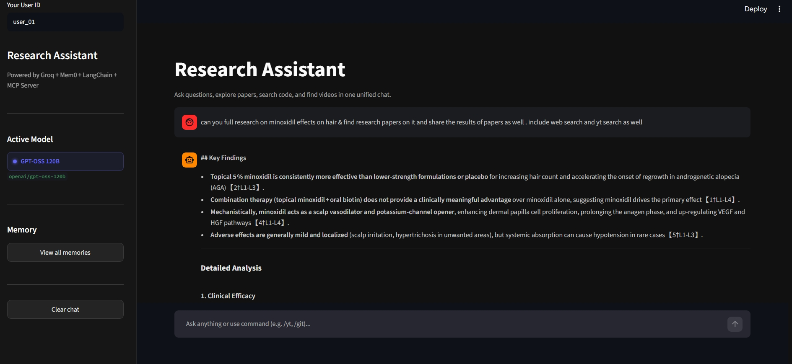
</div>

---

### Research Output — Detailed Analysis

<div align="center">
  <table>
    <tr>
      <td align="center" width="50%">
        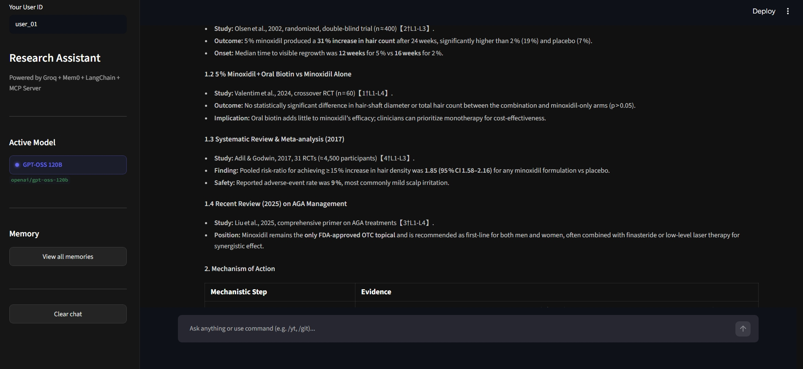
        <br/><sub>Clinical efficacy analysis with inline citations</sub>
      </td>
      <td align="center" width="50%">
        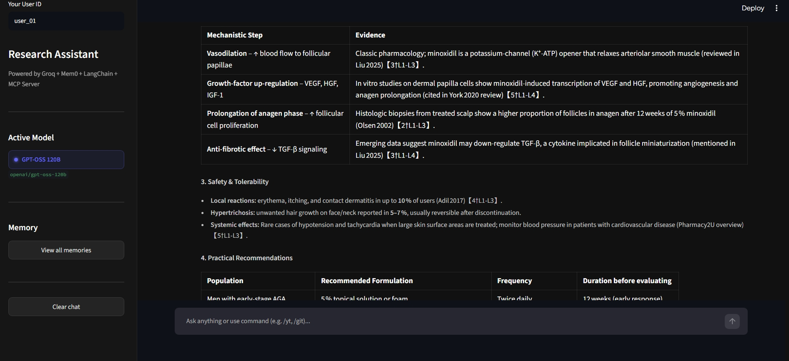
        <br/><sub>Mechanistic breakdown rendered as a table</sub>
      </td>
    </tr>
  </table>
</div>

---

### Research Papers — PubMed Results

<div align="center">
  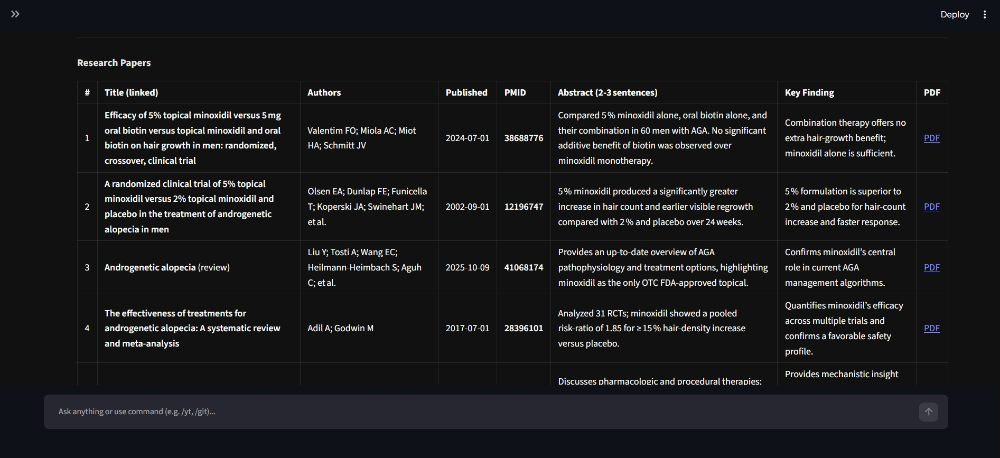
  <br/><sub>PubMed results — full citation table with PMID, authors, abstracts, key findings, and PDF links</sub>
</div>

---

### Web Sources & YouTube Citations

<div align="center">
  
  <br/><sub>Structured web sources and YouTube video citations with channel and main focus</sub>
</div>

---

### YouTube Insights — Compact Video Cards

<div align="center">
  
  <br/><sub>Compact YouTube cards — thumbnail, title, and Watch link side-by-side</sub>
</div>

---

### Tool Toggle Panel & Slash Commands

<div align="center">
  
  <br/><sub>Tool toggle panel — enable/disable individual tools per query and slash command reference</sub>
</div>

---

### YouTube Transcript Analysis via /yt Command

<div align="center">
  <table>
    <tr>
      <td align="center" width="50%">
        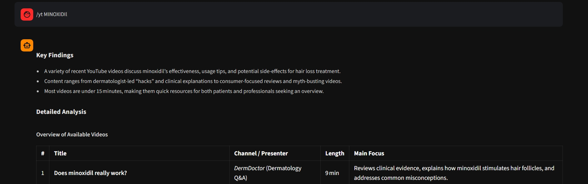
        <br/><sub>/yt command — video table with channel, length, and main focus</sub>
      </td>
      <td align="center" width="50%">
        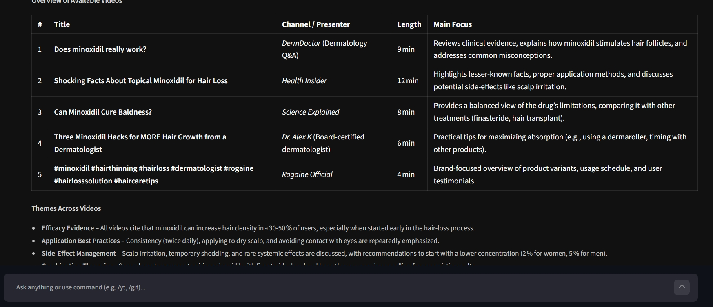
        <br/><sub>Themes analysis across multiple videos</sub>
      </td>
    </tr>
  </table>
</div>

---

## Key Features

### Autonomous Multi-Step Research
The LangChain ReAct loop reasons over tool results iteratively. A single query like *"explain graph RAG"* triggers `web_search` → `arxiv_search` → `fetch_arxiv_paper` (×2–3) → synthesized answer with full citations, with zero manual intervention.

### Smart Paper Database Routing
The system prompt intelligently routes paper searches to the correct database:
- **Medical / clinical / pharmacology / biology** → `pubmed_search` (NCBI PubMed)
- **AI / ML / computer science / physics / math** → `arxiv_search` (arXiv.org)

This prevents the classic mistake of searching arXiv for medical topics and getting physics papers with matching words (e.g. searching "hair loss" and getting *black hole hair* papers).

### Semantic Long-Term Memory
Mem0 extracts facts from each conversation turn and stores them as dense vectors in Qdrant. On the next session, the top-5 most relevant memories are retrieved and injected into the system prompt — the assistant knows what you've already researched.

### 5-Model Cascade — Zero-Drop Rate-Limit Recovery
All five Groq models are initialized at startup. When any model returns a `429`, the agent increments the cascade index and rebinds the next model **mid-loop** — preserving full message history, tool results, and conversation state across the switch.

| Priority | Model | Strength |
|---|---|---|
| 1 (Primary) | `openai/gpt-oss-120b` | Strongest reasoning, best tool use |
| 2 | `qwen/qwen3.6-27b` | Coding specialist, 262K context |
| 3 | `llama-3.3-70b-versatile` | Reliable all-rounder |
| 4 | `qwen/qwen3-32b` | Solid RAG + coding |
| 5 (Last resort) | `openai/gpt-oss-20b` | Fastest, lightest |

### Live Model Indicator
A glowing colored dot in the sidebar and a small badge under every reply shows exactly which model answered — color-coded per model, updates in real time.

### PubMed Full-Pipeline Integration
Three-stage NCBI EUtils pipeline: `esearch` (discover PMIDs) → `esummary` (metadata: title, authors, journal, date) → `efetch` (full abstract text). Returns properly formatted citations with PubMed URLs.

### arXiv Full-Text PDF Reading
`fetch_arxiv_paper` downloads the actual PDF and extracts its full text — the LLM reasons over methodology sections, results, and conclusions, not just the abstract title.

### YouTube Intelligence
Search for tutorial videos on any topic and extract full transcripts for summarization — useful for understanding talks, lectures, and demos without watching them.

### GitHub Code Discovery
Search repositories by topic returning name, stars, description, and URL — rendered as interactive dark-theme cards in the UI.

### Malformed Tool Call Recovery
A regex-based parser recovers tool calls that arrive as raw text instead of structured JSON (a known edge case in some Groq model responses), preventing silent failures.

### FastMCP Protocol Layer
All tools are exposed as a FastMCP server (`src/mcp_server.py`) over stdio — compatible with any MCP-capable client or orchestrator.

### Per-User Isolation
Every memory operation is scoped to a `user_id`, enabling true multi-tenant behavior where each user has a completely separate research history.

---

## Architecture

### High-Level Architecture

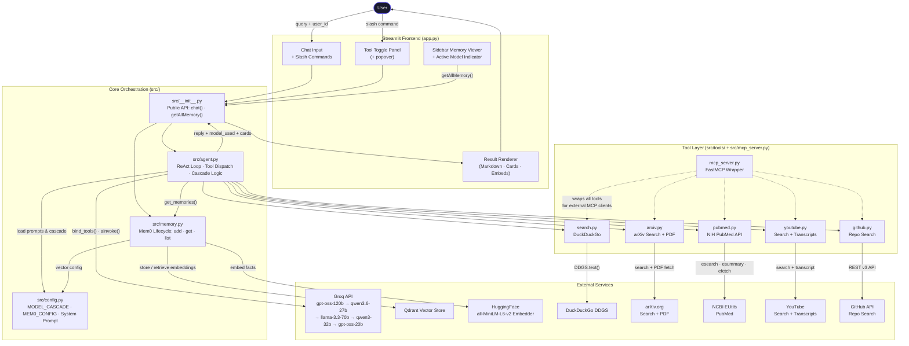

---

### Request Lifecycle — Sequence Diagram

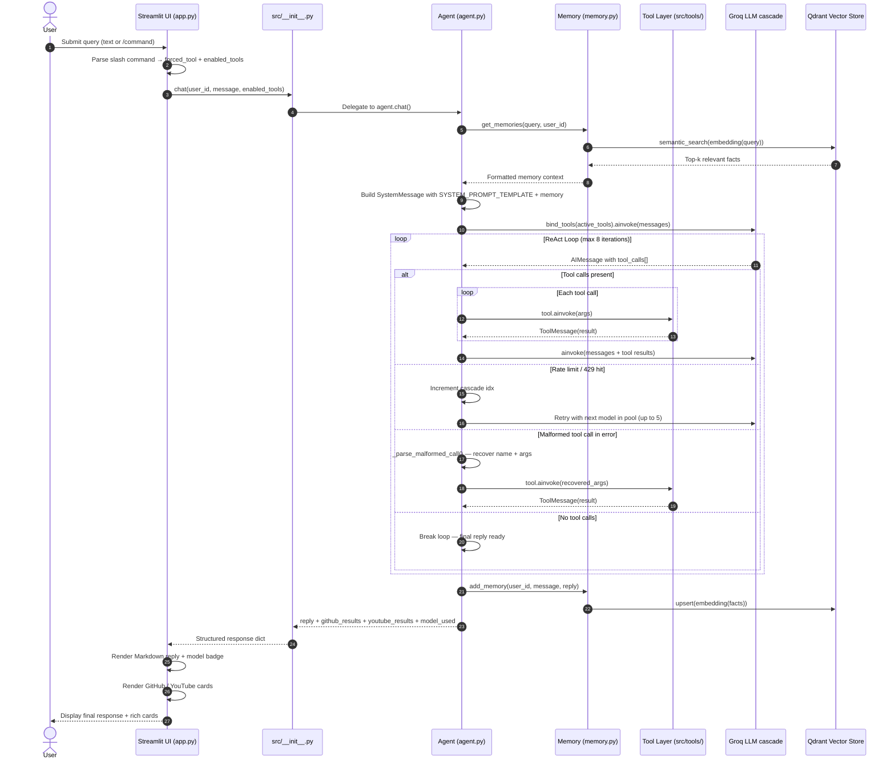

---

### Agent ReAct Execution Loop — State Machine

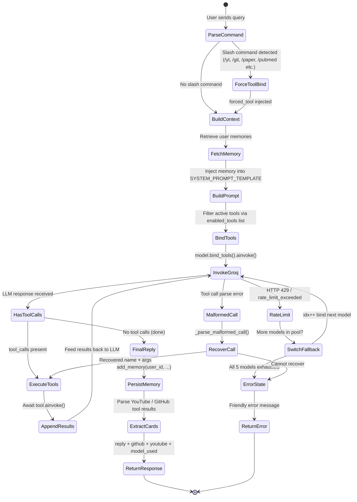

---

### Model Cascade — Automatic Rate-Limit Recovery

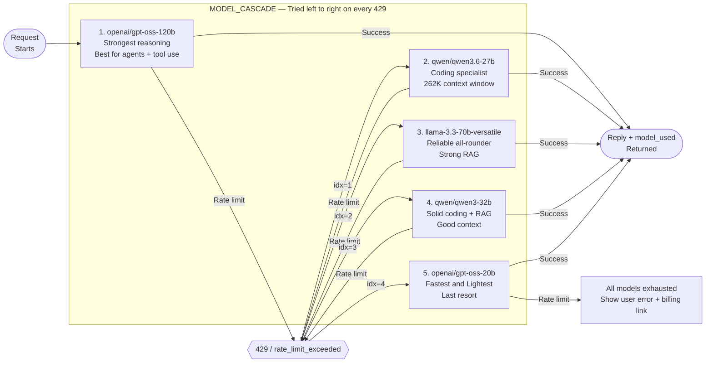

> All 5 models are initialized at startup into `_model_pool`. Switching happens **mid-loop** — the conversation, tool results, and message history are fully preserved across every switch.

---

### Memory System Architecture

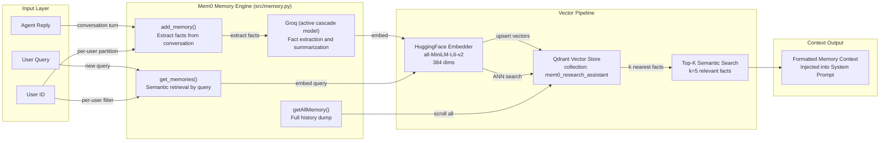

---

### Tool Ecosystem Map

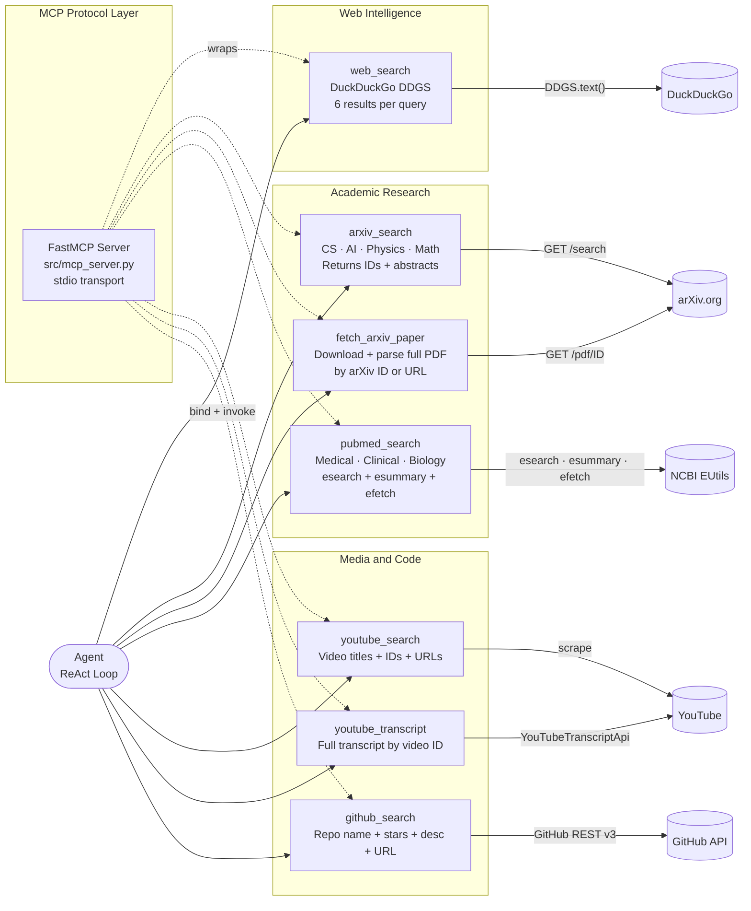

---

### Slash Command Routing

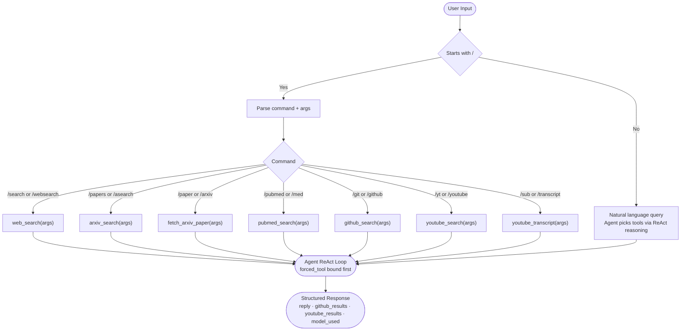

---

## How It Works

**Step 1 — Input parsing**
The user types a query or uses a slash command like `/pubmed minoxidil hair loss`. `app.py` detects the prefix, sets `forced_tool = "pubmed_search"`, and calls `chat(user_id, message, enabled_tools)`.

**Step 2 — Memory retrieval**
`agent.chat()` calls `get_memories(query, user_id)` which embeds the query using `all-MiniLM-L6-v2` and runs ANN search against Qdrant. The top-5 semantically relevant facts from past sessions are returned and formatted into the system prompt.

**Step 3 — Model selection**
The agent picks the first available model from `MODEL_CASCADE` (starting at index 0: `openai/gpt-oss-120b`), binds the active tool set with `model.bind_tools(tools)`, and invokes the LLM.

**Step 4 — ReAct reasoning loop (max 8 iterations)**
The LLM returns an `AIMessage`. If it contains `tool_calls`, the agent executes each tool, appends `ToolMessage` results, and re-invokes the LLM. This continues until the model returns a reply with no tool calls. On a `429`, the cascade index increments and the next model takes over without losing state.

**Step 5 — Tool database routing**
The system prompt instructs the model: medical queries → `pubmed_search`, CS/AI queries → `arxiv_search`. For arXiv results, the agent also calls `fetch_arxiv_paper` to read the full PDF of the top 2–3 papers.

**Step 6 — Memory persistence**
After the final reply, `add_memory(user_id, message, reply)` extracts key facts from the conversation and upserts them as embeddings into Qdrant under the user's partition.

**Step 7 — Response rendering**
The structured dict `{reply, github_results, youtube_results, model_used}` is returned to `app.py`. The reply renders as markdown, GitHub repos as dark-theme cards with star counts, YouTube videos as compact thumbnail cards. The active model badge updates in the sidebar and below the reply.

---

## Tech Stack

| Layer | Technology | Role |
|---|---|---|
| LLM #1 (Primary) | Groq `openai/gpt-oss-120b` | Strongest reasoning + tool calling |
| LLM #2 | Groq `qwen/qwen3.6-27b` | Coding + long-context RAG |
| LLM #3 | Groq `llama-3.3-70b-versatile` | All-rounder |
| LLM #4 | Groq `qwen/qwen3-32b` | Solid coding + RAG fallback |
| LLM #5 (Last resort) | Groq `openai/gpt-oss-20b` | Fastest, lightest |
| Agent Framework | LangChain (`init_chat_model`, `bind_tools`) | ReAct loop and tool dispatch |
| Memory Engine | Mem0 | Fact extraction, storage, and retrieval |
| Vector Database | Qdrant (`./qdrant_store`) | Persistent dense vector storage |
| Embedder | HuggingFace `all-MiniLM-L6-v2` | 384-dim sentence embeddings |
| MCP Layer | FastMCP | Tool protocol server (stdio transport) |
| UI | Streamlit | Chat interface and rich card rendering |
| Web Search | DuckDuckGo DDGS | Scrape-free web results (6 per query) |
| CS/AI Papers | arXiv API + PDF | Paper discovery and full-text reading |
| Medical Papers | NCBI EUtils (PubMed) | Peer-reviewed biomedical literature |
| Video | YouTube Transcript API | Video search and transcript extraction |
| Code | GitHub REST v3 | Repository search |
| Environment | python-dotenv | API key management |

---

## Project Structure

```
Personal research assistant/
│
├── app.py                          # Streamlit dashboard — entry point
├── requirements.txt                # All Python dependencies
├── .env                            # Secret keys (not committed)
├── .gitignore
├── README.md
│
├── public/                         # Screenshots and architecture diagrams
│   ├── system design.jpeg          # Full system architecture (Eraser.io)
│   ├── slah tools and skill.jpeg   # Tool toggle panel screenshot
│   ├── youtub.jpeg                 # YouTube compact cards screenshot
│   └── Screenshot_*.jpeg           # Dashboard and output screenshots
│
├── qdrant_store/                   # Persistent vector DB (auto-created, git-ignored)
│
├── src/                            # Core application package
│   ├── __init__.py                 # Public API: chat(), getAllMemory()
│   ├── config.py                   # MODEL_CASCADE, MEM0_CONFIG, SYSTEM_PROMPT_TEMPLATE
│   ├── agent.py                    # ReAct loop, tool binding, cascade, slash routing
│   ├── memory.py                   # Mem0 wrapper: add_memory(), get_memories(), getAllMemory()
│   ├── mcp_server.py               # FastMCP server exposing all 7 tools over stdio
│   │
│   └── tools/                      # Modular tool implementations
│       ├── __init__.py
│       ├── search.py               # DuckDuckGo DDGS web search
│       ├── arxiv.py                # arXiv keyword search + full PDF text extraction
│       ├── pubmed.py               # PubMed search via NCBI EUtils (esearch/esummary/efetch)
│       ├── youtube.py              # YouTube search + transcript fetching
│       └── github.py              # GitHub repository search (REST v3)
│
└── tests/                          # Test suite
    ├── __init__.py
    ├── test_agent.py               # End-to-end agent + tool-call test
    ├── test_imports.py             # Dependency import verification
    └── test_memory.py              # Mem0 initialization + embedding test
```

---

## Getting Started

**1. Clone the repository**
```bash
git clone <repository-url>
cd "Personal research assistant"
```

**2. Create and activate a virtual environment**
```bash
python -m venv venv

# Windows
venv\Scripts\activate

# macOS / Linux
source venv/bin/activate
```

**3. Install dependencies**
```bash
pip install -r requirements.txt
```

**4. Add your API key** (see [Configuration](#configuration))

**5. Run the app**
```bash
streamlit run app.py
```

Open `http://localhost:8501` in your browser.

---

## Configuration

### Environment Variables

Create a `.env` file in the project root:

```env
GROQ_API_KEY=your_groq_api_key_here
```

Get a free Groq API key at [console.groq.com](https://console.groq.com).

### Model Cascade (`src/config.py`)

```python
MODEL_CASCADE = [
    "groq:openai/gpt-oss-120b",      # strongest — tried first
    "groq:qwen/qwen3.6-27b",         # coding + 262K context
    "groq:llama-3.3-70b-versatile",  # reliable all-rounder
    "groq:qwen/qwen3-32b",           # solid RAG fallback
    "groq:openai/gpt-oss-20b",       # fastest — last resort
]
```

### Memory Config (`src/config.py`)

```python
MEM0_CONFIG = {
    "llm": {
        "provider": "groq",
        "config": {"model": "openai/gpt-oss-20b"},
    },
    "vector_store": {
        "provider": "qdrant",
        "config": {
            "collection_name": "mem0_research_assistant",
            "embedding_model_dims": 384,
            "path": "./qdrant_store",    # persists to disk across restarts
        },
    },
    "embedder": {
        "provider": "huggingface",
        "config": {
            "model": "sentence-transformers/all-MiniLM-L6-v2",
            "embedding_dims": 384,
        },
    },
}
```

---

## Usage

### Natural Language Queries

```
What are the latest breakthroughs in quantum computing?
What does minoxidil do for hair loss and what does the research say?
Explain the difference between RAG and fine-tuning for LLMs
Find me repositories for building agentic AI systems
```

### Slash Commands

| Command | Alias | Description | Tool |
|---|---|---|---|
| `/search <query>` | `/websearch` | Web search only | `web_search` |
| `/papers <topic>` | `/asearch` | arXiv paper search | `arxiv_search` |
| `/paper <id>` | `/arxiv` | Read full arXiv PDF | `fetch_arxiv_paper` |
| `/pubmed <topic>` | `/med` `/medical` | PubMed medical search | `pubmed_search` |
| `/git <query>` | `/github` | GitHub repo search | `github_search` |
| `/yt <query>` | `/youtube` | YouTube video search | `youtube_search` |
| `/sub <video_id>` | `/transcript` | Get video transcript | `youtube_transcript` |

### Tool Toggle Panel

Click the `+` button next to the chat input to enable or disable individual tools per query.

### MCP Server (Standalone)

```bash
python -m src.mcp_server
```

---

## Demo Knowledge Base

### AI & Machine Learning
```
Explain how attention mechanisms work in transformers — find the original paper
What are the key differences between RAG and fine-tuning?
Search for the best open-source LLM agent frameworks on GitHub
```

### Medical & Health Research
```
What does the research say about minoxidil for hair loss?
Find PubMed papers on intermittent fasting and metabolic health
What are the side effects of GLP-1 receptor agonists?
```

### Computer Science
```
What are the latest advances in graph neural networks?
/papers diffusion models image generation
Find tutorials on building RAG systems with LangChain
```

---

## Test Scenarios

**Memory system:**
```bash
python -m tests.test_memory
```
Expected: `SUCCESS: Memory initialized successfully!`

**Module imports:**
```bash
python -m tests.test_imports
```

**End-to-end agent:**
```bash
python -m tests.test_agent
```

### Manual Test Matrix

| Scenario | Input | Expected |
|---|---|---|
| Medical routing | `what does minoxidil do` | Calls `pubmed_search`, not `arxiv_search` |
| CS routing | `explain graph neural networks` | Calls `arxiv_search` + `fetch_arxiv_paper` |
| Slash force tool | `/git langchain agents` | Calls `github_search` directly |
| YouTube cards | `/yt attention is all you need` | Compact thumbnail cards |
| Model cascade | Hit rate limit | Badge in sidebar changes model |
| Memory recall | Topic from a previous session | System prompt includes prior context |
| Tool toggle | Disable arXiv | Agent skips arXiv, uses web only |

---

## Roadmap

| Status | Feature |
|---|---|
| Done | 7-tool ecosystem (web, arXiv, PubMed, YouTube x2, GitHub) |
| Done | 5-model cascade with mid-loop switching |
| Done | Live model indicator (sidebar + per-reply badge) |
| Done | Smart database routing (PubMed vs arXiv) |
| Done | Per-user memory isolation with disk persistence |
| Done | FastMCP server for external integrations |
| Done | Slash command routing with forced tool binding |
| Planned | Semantic Scholar tool for broader academic coverage |
| Planned | PDF upload — research your own documents |
| Planned | Export session as formatted research report |
| Planned | Streaming responses (token-by-token rendering) |
| Planned | Citation graph — visualize paper relationships |
| Planned | Scheduled research digests |

---

## License

This project is provided for educational and personal research use.
